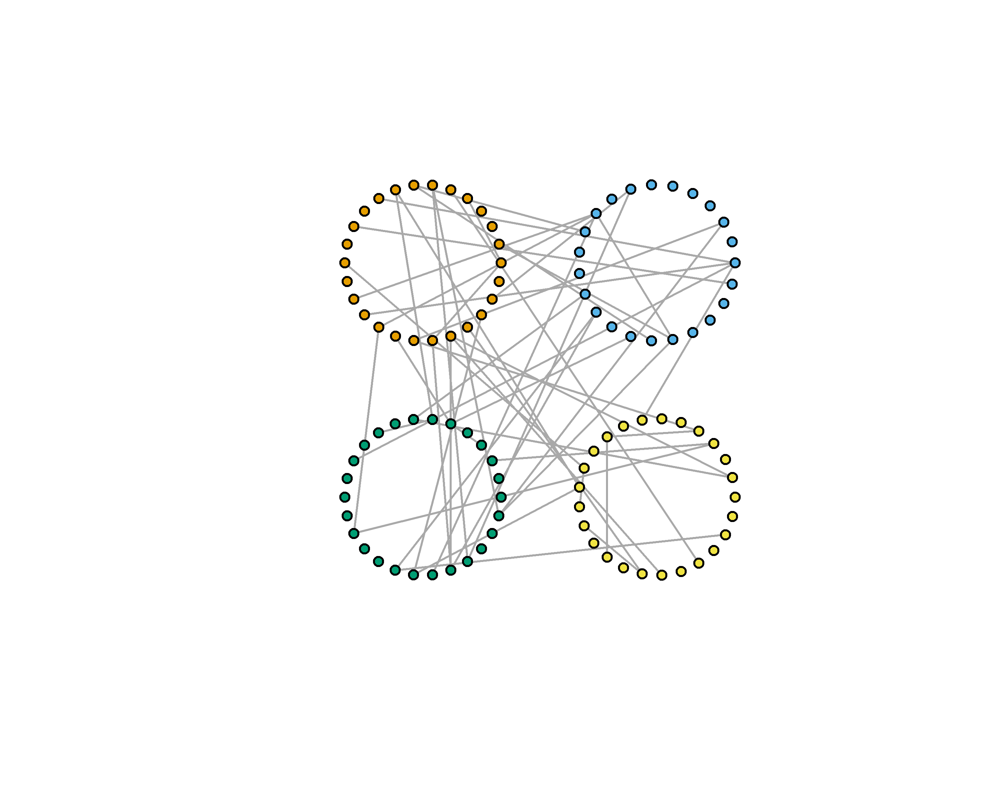
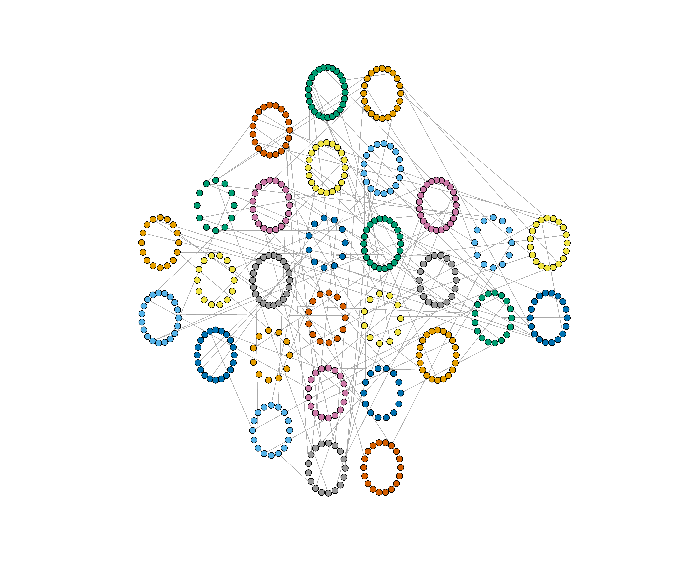

<!-- README.md is generated from README.Rmd. Please edit that file -->

# clusterlayouts

Graph layouts using cluster information. The function calculates a
grouped layout based on the node attribute in `igraph` or `tbl_graph`
object, while respecting the original edge attributes.

``` r
## Make an example graph and assign a random category
library(clusterlayouts)
library(igraph)
test <- igraph::random.graph.game(n=100, p=0.01)
V(test)$category <- as.factor(sample(1:4, 100, replace=TRUE))
lyt <- clusterlayouts::layout_cluster(test, "category")
ggraph(test, layout="manual", x=lyt$x, y=lyt$y)+
    geom_edge_link0(color="grey80")+
    geom_node_point(aes(color=category))+
    theme_graph()
```



``` r
## Can change per cluster layout
test <- igraph::random.graph.game(n=500, p=0.001)
panel <- c(2,3,5,6,6,3,2,2)
V(test)$category <- as.factor(sample(1:sum(panel), 500, replace=TRUE))
lyt <- clusterlayouts::layout_cluster(test, "category", per_row=panel, per_layout="drl")
#> Overriding nrow option
ggraph(test, layout="manual", x=lyt$x, y=lyt$y)+
    geom_edge_link0(color="grey80")+
    geom_node_point(aes(color=category))+
    ggfx::with_outer_glow(
        geom_node_point(aes(color=category, filter=category==29)),
        colour="gold", expand=10
    )+
    theme_graph()
```


``` r
## Can align based on the column
test <- igraph::random.graph.game(n=500, p=0.001)
panel <- c(2,3,5,6,6,3,2,2)
V(test)$category <- as.factor(sample(1:sum(panel), 500, replace=TRUE))
lyt <- clusterlayouts::layout_cluster_col(test, "category", per_col=panel)
#> Overriding ncol option
ggraph(test, layout="manual", x=lyt$x, y=lyt$y)+
    geom_edge_link0(color="grey80")+
    geom_node_point(aes(color=category))+
    ggfx::with_outer_glow(
        geom_node_point(aes(color=category, filter=category==5)),
        colour="gold", expand=10
    )+
    theme_graph()
```



``` r
## Can change widths per column
test <- igraph::random.graph.game(n=1000, p=0.01)
panel <- c(2,4,3,1,5,3,6,7,2,4)
widths <- c(1,2,3,4,5,12,3,2,1,2)
V(test)$category <- as.factor(sample(1:sum(panel), 1000, replace=TRUE))
lyt <- layout_cluster_col(test, "category", 
                          per_col=panel, widths=widths)
#> Overriding ncol option
ggraph(test, layout="manual", x=lyt$x, y=lyt$y)+
    geom_edge_link0(color="grey80")+
    geom_node_point(aes(color=category))+
    scico::scale_color_scico_d()+
    theme_graph()
```


